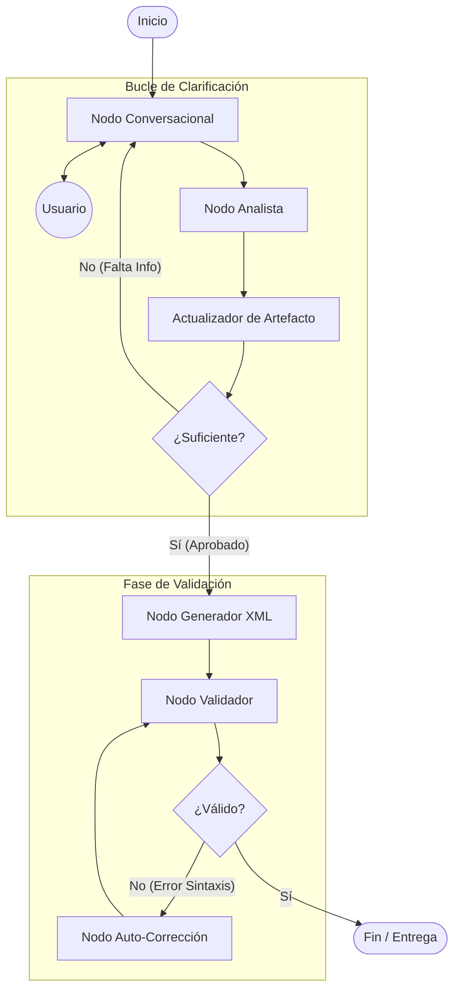

# Documento 03
Arquitectura de Alto Nivel (HLD) y Diseño del Grafo
Sistema Automatizado para la Clarificación y Modelado BPMN
- Control del documento
- Versión: 1.0
- Estado: Diseño Arquitectónico
- Tipo: High Level Design (HLD)
- Documento Fuente: Doc 02 (Data Spec)
- Framework: LangGraph / LangChain

## 1. Visión Global del Grafo
El sistema se implementa como un StateGraph cíclico. A diferencia de un DAG (Grafo Acíclico Dirigido) tradicional, este grafo permite bucles de retroalimentación (conversación) hasta alcanzar un estado de suficiencia.

## 1.1 Diagrama Conceptual del Flujo


## 2. Definición de Nodos (Agentes y Funciones)
Cada nodo recibe el AgentState actual, realiza una tarea y devuelve una actualización parcial del estado.

## 2.1 Nodo Conversacional (chat_node)
- Rol: El facilitador empático.
- Input: Historial de mensajes (messages), Análisis de qué falta (missing_info).
- Función: Genera la respuesta en lenguaje natural para el usuario. Si faltan datos, formula la siguiente pregunta (según reglas del Doc 01).
- Output: Añade un AIMessage al historial.
- **Interacción (Human-in-the-Loop)**: Este nodo es un **punto de interrupción**. El grafo se pausa antes de ejecutar este nodo para esperar input del usuario.

**Implementación del Interrupt:**
```python
# En la definición del grafo
graph.add_node("chat_node", chat_node_function)
# Marcar como punto de interrupción
graph.add_edge(START, "chat_node")
# El grafo se compilará con interrupt_before=["chat_node"]
compiled_graph = graph.compile(checkpointer=memory, interrupt_before=["chat_node"])
```

Cuando el grafo llega a `chat_node`, se detiene automáticamente. El usuario envía su mensaje, que se inyecta en `state["messages"]`, y el grafo se reanuda con `graph.invoke(None, config)`.

## 2.2 Nodo Analista (analyzer_node)
- Rol: El cerebro lógico (oculto al usuario).
- Input: El último mensaje del usuario y el process_artifact actual.
- Función: 
    - Interpreta la intención del usuario.
    - Extrae entidades (tareas, roles, decisiones).
    - Mapea texto a estructura JSON.
- Output: Genera una estructura ProcessUpdate (definida en Doc 02). No genera texto para el usuario.

## 2.3 Nodo Actualizador de Estado (artifact_updater)
- Rol: El escribano (función determinista, no LLM).
- Input: ProcessUpdate (del analista) y process_artifact actual.
- Función: Aplica los cambios al JSON:
    - Crea nuevos nodos.
    - Conecta aristas.
    - Registra la decisión en el decision_log.
- Output: Nuevo process_artifact actualizado.

## 2.4 Nodo de Revisión (critic_node)
- Rol: El guardián de calidad.
- Input: process_artifact completo.
- Función: Evalúa si se cumple el Criterio de Suficiencia (Doc 00/01).
    - ¿Hay inicio y fin?
    - ¿Grafo conexo?
    - ¿Ambigüedades críticas?
- Output: Actualiza flags en el estado: is_sufficient (bool) y next_step_recommendation.

## 2.5 Nodo Generador (xml_generator_node)
- Rol: El ingeniero.
- Input: process_artifact (JSON aprobado).
- Función: Transforma el JSON a XML BPMN 2.0 estándar mediante código determinista (Jinja2 templates o lxml). **No usa LLM** para evitar alucinaciones sintácticas.
- Output: String con el contenido XML.
- Nota: Este nodo es 100% determinista. Dado el mismo ProcessArtifact, siempre genera el mismo XML.

### 2.5.1 Algoritmo de Layout DI (Manhattan Grid - ISO 19510)

El generador usa un algoritmo ortogonal (ángulos de 90°) para coordenadas BPMN Diagram Interchange (DI). Este algoritmo garantiza diagramas profesionales sin superposiciones.

**Parámetros del Grid Base:**
```python
# Constantes de layout
GRID_START_X = 200
GRID_START_Y = 200
HORIZONTAL_STEP = 180  # Avance entre elementos en secuencia
VERTICAL_BRANCH_OFFSET = 150  # Separación vertical para ramas paralelas
DATA_OBJECT_Y_OFFSET = -100  # Data Objects flotan encima de tareas
BOUNDARY_EVENT_X_OFFSET = 80  # Posición relativa a tarea padre
BOUNDARY_EVENT_Y_OFFSET = 60  # Esquina inferior derecha
```

**Reglas de Posicionamiento:**

1. **Elementos Secuenciales (Tareas, Eventos):**
   - Primer elemento: `X = GRID_START_X, Y = GRID_START_Y`
   - Siguiente elemento: `X = X_anterior + HORIZONTAL_STEP, Y = Y_anterior`
   - Mantener misma Y para flujo horizontal

2. **Gateways Divergentes (Decisiones):**
   - Gateway: `X = X_anterior + HORIZONTAL_STEP, Y = Y_base`
   - Rama superior: `Y = Y_base - VERTICAL_BRANCH_OFFSET`
   - Rama inferior: `Y = Y_base + VERTICAL_BRANCH_OFFSET`
   - Rama central (si existe): `Y = Y_base`

3. **Gateways Convergentes (Joins):**
   - Posicionar después de la rama más larga
   - `X = max(X_ramas) + HORIZONTAL_STEP`
   - `Y = Y_base` (volver a línea central)

4. **Data Objects (Elementos Flotantes):**
   - Posición: Encima de la tarea que los usa
   - `X = X_tarea` (misma X que la tarea)
   - `Y = Y_tarea + DATA_OBJECT_Y_OFFSET`

5. **Boundary Events (Adjuntos a Tareas):**
   - Posición: Esquina inferior derecha de la tarea padre
   - `X = X_tarea + BOUNDARY_EVENT_X_OFFSET`
   - `Y = Y_tarea + BOUNDARY_EVENT_Y_OFFSET`

6. **SubProcesos:**
   - Dimensiones: `width = 350, height = 200` (expandidos)
   - Posición: Igual que tareas normales
   - Contenido interno: Grid recursivo con offset `(X_sub + 20, Y_sub + 40)`

**Ruteo de Líneas (Waypoints Ortogonales):**
```python
def calculate_waypoints(source_node, target_node):
    """Genera waypoints para líneas con ángulos de 90°."""
    source_center = (source_node.x + source_node.width/2, source_node.y + source_node.height/2)
    target_center = (target_node.x + target_node.width/2, target_node.y + target_node.height/2)
    
    waypoints = [source_center]
    
    # Si hay diferencia vertical, añadir codo
    if abs(source_center[1] - target_center[1]) > 10:
        # Punto intermedio: misma X que origen, misma Y que destino
        waypoints.append((source_center[0], target_center[1]))
    
    waypoints.append(target_center)
    return waypoints
```

**Ejemplo de Coordenadas Generadas:**
```xml
<!-- StartEvent -->
<bpmndi:BPMNShape id="shape_start" bpmnElement="start_1">
  <dc:Bounds x="200" y="200" width="36" height="36" />
</bpmndi:BPMNShape>

<!-- UserTask -->
<bpmndi:BPMNShape id="shape_task1" bpmnElement="task_1">
  <dc:Bounds x="280" y="180" width="100" height="80" />
</bpmndi:BPMNShape>

<!-- DataObject (flotante encima) -->
<bpmndi:BPMNShape id="shape_data1" bpmnElement="data_1">
  <dc:Bounds x="280" y="80" width="36" height="50" />
</bpmndi:BPMNShape>

<!-- BoundaryEvent (adjunto a task_1) -->
<bpmndi:BPMNShape id="shape_error1" bpmnElement="error_1">
  <dc:Bounds x="360" y="240" width="36" height="36" />
</bpmndi:BPMNShape>

<!-- SequenceFlow con waypoints ortogonales -->
<bpmndi:BPMNEdge id="edge_flow1" bpmnElement="flow_1">
  <di:waypoint x="236" y="218" />  <!-- Centro de StartEvent -->
  <di:waypoint x="280" y="220" />  <!-- Entrada de Task -->
</bpmndi:BPMNEdge>
```

**Ventajas del Algoritmo:**
- ✅ Diagramas profesionales sin superposiciones
- ✅ Fácil de debuggear (coordenadas predecibles)
- ✅ Compatible con bpmn-js y Camunda Modeler
- ✅ Escalable a procesos complejos

## 2.6 Nodo Auto-Corrección (autofix_node)
- Rol: El reparador técnico de emergencia.
- Input: XML inválido + mensaje de error del validador (ej: "SequenceFlow_1 has no targetRef").
- Función: Intenta corregir errores sintácticos del XML usando un LLM con instrucciones restrictivas. Solo arregla la sintaxis, **nunca modifica la lógica del negocio** (nombres de tareas, flujo de decisiones).
- Output: XML corregido o error si no puede arreglarlo después de 3 intentos.
- Límite: Máximo 3 intentos controlados por `revision_count` en el estado. Si falla 3 veces, el grafo reporta error al usuario vía `chat_node`.
- Casos de uso: IDs duplicados, referencias rotas, atributos faltantes en elementos XML.

## 3. Lógica de Aristas (Conditional Edges)
Las aristas definen la inteligencia de enrutamiento del sistema.

### 3.1 Router Principal (after_update_router)
Se ejecuta después del critic_node.
- Condición A: Si is_sufficient == False → Ir a chat_node (para pedir más info).
- Condición B: Si is_sufficient == True Y user_approved == False → Ir a chat_node (para pedir confirmación final: "Tengo todo listo, ¿generamos?").
- Condición C: Si user_approved == True → Ir a xml_generator_node.

### 3.2 Router de Validación (after_validation_router)
Se ejecuta después de validar el XML generado.
- Condición A: Si errors == [] (Sin errores) → Ir a End.
- Condición B: Si errors != [] Y retry_count < 3 → Ir a AutoFixNode.
- Condición C: Si errors != [] Y retry_count >= 3 → Ir a chat_node (Reportar error técnico al usuario y pedir intervención).

### 3.3 Implementación de Routers (Código LangGraph)
Los routers son funciones Python que reciben el estado y devuelven el nombre del siguiente nodo como string.

**Router Principal:**
```python
def after_update_router(state: AgentState) -> str:
    """Decide el siguiente nodo después de critic_node."""
    if not state["is_sufficient"]:
        # Falta información crítica
        return "chat_node"
    elif not state["user_approved"]:
        # Proceso completo pero sin aprobación del usuario
        return "chat_node"
    else:
        # Todo listo, proceder a generación
        return "xml_generator_node"
```

**Router de Validación:**
```python
def after_validation_router(state: AgentState) -> str:
    """Decide el siguiente nodo después de validar el XML."""
    errors = state.get("validation_errors", [])
    retry_count = state.get("revision_count", 0)
    
    if len(errors) == 0:
        # XML válido, terminar
        return END
    elif retry_count < 3:
        # Intentar auto-corrección
        return "autofix_node"
    else:
        # Demasiados intentos, escalar a humano
        return "chat_node"
```

**Uso en el grafo:**
```python
from langgraph.graph import StateGraph, END

graph = StateGraph(AgentState)
# ... añadir nodos ...
graph.add_conditional_edges("critic_node", after_update_router)
graph.add_conditional_edges("validation_node", after_validation_router)
```

### 4. Estrategia de Persistencia y Human-in-the-loop
#### 4.1 Puntos de Control (Checkpoints)
LangGraph guardará el estado automáticamente al finalizar cada super-paso.

Persistence Layer: SQLite (para desarrollo) / Postgres (producción).

Thread ID: Cada proceso de negocio distinto tendrá su propio thread_id.

### 4.2 Intervención Humana
El sistema no es 100% autónomo. Requiere pausas:

- Pausa de Entrada: En chat_node, el grafo se detiene esperando input. LangGraph gestiona esto de forma nativa: el grafo corre hasta que necesita al usuario, guarda estado y duerme. Cuando el usuario envía mensaje, el grafo despierta ("resume") con el nuevo input inyectado en el estado.

- Pausa de Aprobación: Antes de pasar al xml_generator_node, incluso si el sistema cree que está listo, debe haber una confirmación explícita.

## 5. Diseño de Componentes Técnicos
### 5.1 Stack de IA
- LLM Principal (Analista/Chat): GPT-4o o Claude 3.5 Sonnet (necesita alto razonamiento y contexto).
- LLM Secundario (Generador/Fix): GPT-4o mini o GPT-3.5-turbo (para tareas mecánicas de XML si se usa LLM, aunque se prefiere lógica determinista).
- Framework: LangChain ChatOpenAI con with_structured_output.

### 5.2 Estructura del Proyecto (Carpetas)
```plaintext
/src
  /agents
    analyst.py       # Lógica del analista
    critic.py        # Lógica de revisión
    generator.py     # Lógica de conversión XML
  /graph
    workflow.py      # Definición de Nodos y Aristas (StateGraph)
    state.py         # Definición del AgentState (Doc 02)
  /models
    schema.py        # Pydantic Models (ProcessArtifact)
  /utils
    bpmn_validator.py # Validador sintáctico (lxml)
```

### 6. Manejo de Errores y Límites
#### 6.1 Alucinaciones de Estructura
Si el analyzer_node devuelve IDs que no existen o conexiones imposibles, el artifact_updater (que es código Python determinista) lanzará una excepción controlada, revertirá el cambio y forzará al grafo a pedir aclaración de nuevo o reintentar internamente sin molestar al usuario.

#### 6.2 Límite de Contexto
Antes de entrar al chat_node, se ejecutará una función trim_messages que:
- Mantiene los últimos N mensajes de chat.
- Mantiene SIEMPRE el SystemMessage inicial.
- No necesita mantener toda la historia de cambios del JSON, ya que el process_artifact actual siempre viaja completo en un campo separado del estado.

---

## 7. Escalabilidad Futura: Nodo de Consulta de Conocimiento (OPCIONAL)

### 7.1 Contexto
La versión inicial del sistema incluye reglas ISO 19510 **embebidas** en los prompts (Doc 04). Esto es suficiente para el 90% de casos y no requiere infraestructura adicional.

### 7.2 Cuándo Escalar a RAG (Retrieval-Augmented Generation)
Si en el futuro se necesita:
- Consultar documentación ISO completa (1000+ páginas)
- Añadir múltiples guías BPMN actualizables
- Responder preguntas técnicas avanzadas no cubiertas por reglas básicas

Se puede añadir un **nodo opcional de consulta de conocimiento**.

### 7.3 Diseño del Nodo (Para Implementación Futura)

```python
## 2.7 Nodo de Consulta de Conocimiento (knowledge_retrieval_node) - OPCIONAL

- Rol: Bibliotecario experto en BPMN.
- Input: Pregunta técnica del usuario o duda del analista.
- Función: 
    - Busca en base vectorial (ChromaDB/Pinecone) de documentos ISO/BPMN
    - Recupera top-K fragmentos más relevantes
    - Inyecta en contexto del siguiente nodo
- Output: Actualiza `knowledge_context` en el estado con fragmentos relevantes.
- Activación: Condicional, solo si se detectan palabras clave ("¿cómo modelar?", "diferencia entre", "ISO dice").
```

### 7.4 Integración en el Grafo

**Router condicional** antes del `analyzer_node`:
```python
def should_retrieve_knowledge(state: AgentState) -> str:
    """Decide si consultar la base de conocimiento antes de analizar."""
    last_msg = state["messages"][-1].content.lower()
    
    # Palabras clave que indican consulta técnica
    technical_keywords = [
        "cómo modelar", "qué tipo de", "diferencia entre",
        "iso", "estándar", "bpmn 2.0", "evento de compensación"
    ]
    
    if any(kw in last_msg for kw in technical_keywords):
        return "knowledge_retrieval_node"
    else:
        return "analyzer_node"

# En el grafo
graph.add_conditional_edges("chat_node", should_retrieve_knowledge)
graph.add_edge("knowledge_retrieval_node", "analyzer_node")
```

### 7.5 Preparación del Código Base

**Para facilitar la integración futura**, el código debe:

1. **Separar reglas ISO del prompt**:
   ```python
   # En lugar de hardcodear en el prompt:
   ISO_RULES = load_iso_rules()  # Función que puede leer de archivo o DB
   
   system_prompt = f"""
   REGLAS DE MODELADO BPMN 2.0:
   {ISO_RULES}
   
   {knowledge_context if knowledge_context else ""}
   """
   ```

2. **Añadir campo opcional en AgentState**:
   ```python
   class AgentState(TypedDict):
       # ... campos existentes ...
       knowledge_context: Optional[str]  # Para RAG futuro
   ```

3. **Modularizar prompts**:
   ```
   /prompts
     /base
       analyst_base.txt      # Reglas core (siempre)
     /knowledge
       iso_19510_extract.txt # Extracto manual (v1.0)
       # Futuro: reemplazar con RAG
   ```

### 7.6 Estimación de Esfuerzo

**Si se decide implementar RAG en el futuro:**
- Procesamiento de PDFs: 2-3 horas
- Setup ChromaDB: 1 hora
- Integración en grafo: 2-3 horas
- Testing: 2 horas
- **Total**: ~1 día de trabajo

**Costo operacional adicional:**
- Embeddings (OpenAI): ~$0.0001 por 1K tokens
- ChromaDB: Gratis (local) o ~$20/mes (cloud)

### 7.7 Decisión de Implementación

**Criterios para activar RAG:**
- ✅ Si el usuario pregunta >5 veces por elementos BPMN no cubiertos
- ✅ Si se añaden nuevas guías/estándares (ej: BPMN 2.0.2, DMN)
- ✅ Si se necesita soporte multiidioma (traducir documentación)

**Hasta entonces**: Las reglas embebidas en Doc 04 son suficientes.

---

## 8. Próximos Pasos
Con la arquitectura definida, el siguiente paso es bajar al nivel de implementación de los "cerebros" de los agentes: Los Prompts.